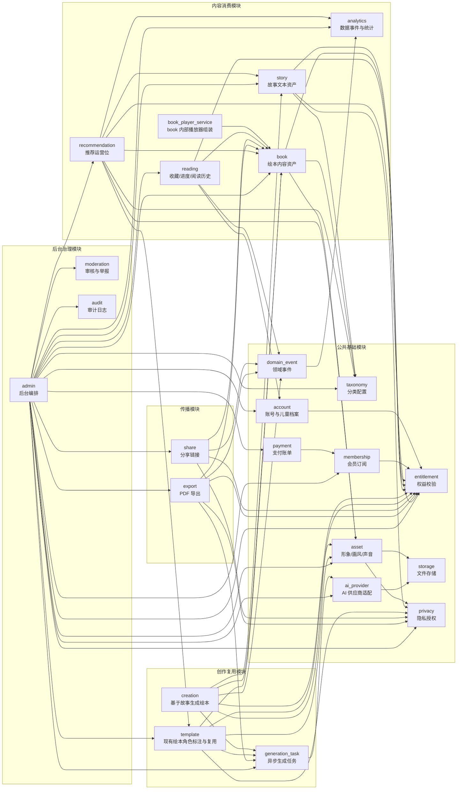

# 绘本网站后端模块结构设计

## 1. 设计原则

目标是支持多人并行开发，因此模块划分优先保证 **高内聚、低耦合、边界清晰、接口协作稳定**。

核心原则：

- 每个模块只拥有自己的业务数据和写逻辑，其他模块不得跨 service 直接修改。
- 模块之间通过 service 方法、领域事件或稳定 DTO 协作，不直接依赖对方内部表结构和实现细节。
- “故事、绘本、模板”必须保持领域边界：故事是纯文本资产；绘本是可播放内容资产；模板不是独立内容资产，而是基于现有绘本增加角色标注后的复用配置。
- 权限、会员权益、素材存储、生成任务这类横切能力集中封装，避免散落在各业务模块中。
- 前台接口、后台接口可以分开写，但底层业务规则必须沉到同一个 service，避免两套逻辑。

## 2. 推荐目录结构

当前项目已有 `api / schema / service / model` 分层，建议继续沿用：

```text
backend/app/
  api/v1/
    account_api.py
    taxonomy_api.py
    story_api.py
    book_api.py
    reading_api.py
    template_api.py
    asset_api.py
    creation_api.py
    generation_task_api.py
    share_api.py
    export_api.py
    membership_api.py
    payment_api.py
    recommendation_api.py
    analytics_api.py
    privacy_api.py
    admin_api.py
    moderation_api.py
  model/
    account.py
    taxonomy.py
    story.py
    book.py
    reading.py
    template.py
    asset.py
    creation.py
    generation_task.py
    ai_provider.py
    share.py
    export.py
    membership.py
    payment.py
    recommendation.py
    analytics.py
    privacy.py
    domain_event.py
    moderation.py
    audit.py
  schema/
    account.py
    taxonomy.py
    story.py
    book.py
    reading.py
    template.py
    asset.py
    creation.py
    generation_task.py
    ai_provider.py
    share.py
    export.py
    membership.py
    payment.py
    recommendation.py
    analytics.py
    privacy.py
    domain_event.py
    moderation.py
    audit.py
    admin.py
  service/
    account_service.py
    entitlement_service.py
    taxonomy_service.py
    story_service.py
    book_service.py
    book_player_service.py
    reading_service.py
    template_service.py
    asset_service.py
    storage_service.py
    creation_service.py
    generation_task_service.py
    ai_provider_service.py
    share_service.py
    export_service.py
    membership_service.py
    payment_service.py
    recommendation_service.py
    analytics_service.py
    privacy_service.py
    domain_event_service.py
    admin_service.py
    audit_service.py
```

## 3. 模块划分

### 3.1 账号与儿童档案模块 `account`

负责人边界：

- 负责用户、角色、登录态、儿童档案。
- 负责儿童档案默认形象、默认声音、默认画风的引用关系。
- 不负责会员权益规则本身，不负责形象、声音、画风的创建逻辑。

核心能力：

- 当前用户信息。
- 儿童档案创建、编辑、删除、默认档案。
- 家长账号下多儿童档案隔离。

对外提供：

- `get_current_user()`
- `get_child_profile(profile_id)`
- `list_child_profiles(user_id)`
- `assert_profile_belongs_to_user(profile_id, user_id)`

允许依赖：

- 可调用 `asset` 查询默认形象/声音/画风摘要。
- 可调用 `entitlement` 校验儿童档案数量上限。

禁止依赖：

- 不直接操作绘本、故事、生成任务。

### 3.2 会员权益模块 `membership / entitlement`

负责人边界：

- `membership` 负责会员计划、订阅状态、权益配置。
- `entitlement_service` 负责统一做权益校验和额度扣减。
- 其他模块不得自己判断 VIP、次数限制、数量上限。

核心能力：

- 免费用户、会员用户、管理员权限状态。
- 绘本访问、生成次数、儿童档案数量、个人故事数量、个人形象数量、个人声音数量、分享数量、PDF 导出次数等权益判断。
- 系统故事、系统形象、系统画风、系统声音的 VIP 使用权限。

对外提供：

- `get_user_entitlements(user_id)`
- `can_access_book(user_id, book_id)`
- `can_use_asset(user_id, asset_ref)`
- `assert_can_create(user_id, resource_type)`
- `consume_quota(user_id, quota_key, amount=1)`

允许依赖：

- 可读取账号会员状态。

禁止依赖：

- 不参与具体业务对象创建。
- 不生成绘本、故事、素材。
- 不直接处理支付渠道回调、订单和退款，支付账单归 `payment`。

### 3.3 支付账单模块 `payment`

负责人边界：

- 负责订单、支付记录、支付渠道回调、退款记录和订阅账单。
- 负责把支付结果转换为可被 `membership` 消费的订阅变更事件。
- 不负责会员权益规则本身，不负责具体内容访问判断。

核心能力：

- 创建会员订单。
- 查询订单和支付状态。
- 处理支付成功、失败、退款、取消订阅等回调。
- 记录支付流水和订阅周期。

对外提供：

- `create_membership_order(user_id, plan_id, payload)`
- `get_payment_order(user_id, order_id)`
- `handle_payment_callback(provider, payload)`
- `list_user_payment_records(user_id)`

允许依赖：

- 可读取 `membership` 的会员计划和价格配置。
- 可通知 `membership` 更新订阅状态。
- 必须调用 `audit` 或支付日志记录关键状态变化。

禁止依赖：

- 不判断绘本、故事、素材的访问权益。
- 不创建或修改内容业务对象。
- 不处理儿童档案、绘本生成和分享逻辑。

### 3.4 分类配置模块 `taxonomy`

负责人边界：

- 负责年龄段、主题标签、兴趣标签、教育目标、阅读水平、语言、叙事风格、推荐场景等统一配置。
- 前台筛选、生成配置、后台配置必须使用同一套 taxonomy。

核心能力：

- 分类项查询、启用、停用、排序。
- 稳定 code 与展示名称维护。

对外提供：

- `list_taxonomy(type)`
- `get_taxonomy_item(id)`
- `validate_taxonomy_ids(type, ids)`

允许依赖：

- 基本无业务依赖。

禁止依赖：

- 不依赖故事、绘本、素材、会员。

### 3.5 故事模块 `story`

负责人边界：

- 只负责故事这种“纯文本资产”。
- 负责系统故事和用户故事。
- 不保存页面、插图、音频、对白、播放进度、模板替换区域。

核心能力：

- 我的故事创建、编辑、删除。
- 系统故事列表和详情。
- 上传/粘贴故事。
- 从故事发起绘本生成入口。
- 故事审核状态、发布状态。

对外提供：

- `get_story(story_id)`
- `list_stories(filters)`
- `create_user_story(user_id, payload)`
- `update_user_story(user_id, story_id, payload)`
- `assert_story_usable(user_id, story_id)`

允许依赖：

- 调用 `taxonomy` 校验分类字段。
- 调用 `entitlement` 校验 VIP 系统故事使用权限和个人故事数量。

禁止依赖：

- 不直接创建绘本页面。
- 不直接调用 AI 生成插图、音频。
- 不处理播放器数据。

### 3.6 绘本内容模块 `book`

负责人边界：

- 负责绘本作为“可播放内容资产”的完整模型。
- 负责绘本详情、绘本列表和播放器内容组装。
- 不负责创作流程编排，不负责模板替换规则，不负责 AI 任务调度。
- 不负责用户维度的收藏、阅读进度和阅读历史，这些归 `reading`。

核心能力：

- 绘本基础信息。
- 绘本页面、图片、正文、双语文本、音频、对白、对口型素材。
- 共读提示、学习卡片。
- 免费试看、会员访问的播放器裁剪。
- `book_player_service` 作为 `book` 模块内部文件，负责把页面、媒体、字幕、音频、试看裁剪组装成播放器 payload，不作为独立业务模块。

对外提供：

- `get_book(book_id)`
- `list_books(filters)`
- `get_book_detail(user_id, book_id)`
- `get_player_payload(user_id, book_id, options)`
- `create_book_from_draft(draft_payload)`

允许依赖：

- 调用 `entitlement` 判断访问和试看。
- 调用 `asset` 获取媒体访问地址。
- 调用 `taxonomy` 校验标签。

禁止依赖：

- 不直接处理会员计划。
- 不创建用户形象和声音。
- 不编排 AI 生成步骤。
- 不修改模板角色和替换区域配置。
- 不保存收藏、阅读进度和播放历史。
- 不直接写运营统计事件，播放相关事件由调用方或 `reading` 通过领域事件上报。

### 3.7 阅读状态模块 `reading`

负责人边界：

- 负责用户维度的收藏、阅读进度、阅读历史和继续阅读。
- 负责儿童档案维度的阅读隔离。
- 不负责绘本内容本身，不负责播放器内容组装。

核心能力：

- 收藏、取消收藏、收藏列表。
- 保存和查询阅读进度。
- 最近阅读、继续阅读。
- 记录播放开始、播放完成、页面切换等阅读行为事件。

对外提供：

- `save_reading_progress(user_id, book_id, payload)`
- `get_reading_progress(user_id, book_id, profile_id=None)`
- `list_recent_reads(user_id, profile_id=None)`
- `toggle_favorite(user_id, book_id, payload)`
- `list_favorites(user_id, profile_id=None)`
- `record_play_event(user_id, book_id, event_payload)`

允许依赖：

- 调用 `book` 校验绘本存在和可访问摘要。
- 调用 `account` 校验儿童档案归属。
- 调用 `entitlement` 判断会员绘本是否允许继续阅读。
- 通过 `domain_event` 发布阅读、收藏、完播等事件，供 `analytics` 异步消费。

禁止依赖：

- 不修改绘本正文、页面、音频和媒体。
- 不创建绘本、故事、模板和素材。
- 不直接计算运营统计口径。

### 3.8 绘本模板模块 `template`

负责人边界：

- 负责把现有绘本标记为模板。
- 负责在现有绘本的每一页中标记可替换角色，以及该角色在页面中的头像/形象区域。
- 负责基于模板标注创建个人绘本。
- 模板本身不维护独立页面内容，页面正文、插图背景、音效、互动提示、学习卡片和播放结构都来自原绘本。
- 模板复用时只能替换已标注角色区域和朗读声音，不重新创作绘本结构。

核心能力：

- 将现有绘本设为模板。
- 模板列表、详情、原绘本预览。
- 模板角色清单配置。
- 按页标记角色出现位置。
- 按页标记角色头像/形象替换区域。
- 必填角色校验。
- 模板替换预览。
- 基于模板保存个人绘本。

对外提供：

- `get_template(template_id)`
- `list_templates(filters)`
- `create_template_from_book(book_id, payload)`
- `mark_page_character(template_id, page_id, payload)`
- `update_page_character_region(template_id, region_id, payload)`
- `validate_template_replacements(user_id, template_id, replacements)`
- `preview_template_replacement(user_id, template_id, payload)`
- `create_book_from_template(user_id, template_id, payload)`

允许依赖：

- 调用 `book` 读取原绘本、页面和媒体内容。
- 调用 `book` 基于原绘本复制并创建最终个人绘本。
- 调用 `asset` 读取用户形象、系统形象、上传图片、声音。
- 调用 `entitlement` 校验模板、形象、声音权益。
- 调用 `generation_task` 触发替换合成或音频重生成任务。

禁止依赖：

- 不允许在模板模块中创建新的故事、分镜或页面内容。
- 不允许改写原绘本的正文、画风、背景、页面结构、互动提示和学习卡片。
- 不允许让用户在模板复用流程中重新选择画风或重生成页面。
- 不直接管理故事。

### 3.9 素材模块 `asset`

负责人边界：

- 负责形象、画风、声音、文件资源。
- 负责系统素材和用户素材统一查询。
- 负责素材状态，不负责绘本生成编排。

核心能力：

- 用户形象创建、重命名、删除、设为默认。
- 系统形象列表。
- 系统画风列表、自定义画风描述保存。
- 用户声音上传、处理状态、试听、删除、设为默认。
- 系统声音列表。
- 文件上传准备、上传完成、媒体访问地址。
- 用户上传素材的授权确认和隐私状态引用。

对外提供：

- `get_asset(asset_id)`
- `get_asset_url(asset_id)`
- `list_characters(user_id, filters)`
- `get_character(character_id)`
- `list_art_styles(filters)`
- `get_art_style(style_id)`
- `list_voices(user_id, filters)`
- `get_voice(voice_id)`
- `assert_asset_usable(user_id, asset_type, asset_id)`

允许依赖：

- 调用 `entitlement` 校验 VIP 素材使用和个人素材数量上限。
- 调用 `storage` 处理文件存储。
- 调用 `privacy` 记录上传授权、个人素材隐私状态和删除保留策略。

禁止依赖：

- 不创建绘本。
- 不保存阅读进度。
- 不处理模板替换业务规则。
- 不直接处理分享、导出前的隐私确认。

### 3.10 创作生成模块 `creation`

负责人边界：

- 负责“基于故事生成绘本”的流程编排。
- 负责创作会话、步骤状态、草稿、生成任务串联。
- 不负责系统故事本身的 CRUD，不负责素材库本身的 CRUD。

核心能力：

- 创建创作会话。
- 选择故事、形象、画风、声音。
- 从一个想法生成故事。
- 生成分镜。
- 编辑分镜。
- 生成插图、语音、对口型素材。
- 局部重新生成。
- 保存到个人绘本库。
- 基于已有绘本创建类似作品的创作会话，只复用主题、适龄范围、长度、画风等参考信息，不复制原文和图片。

对外提供：

- `create_session(user_id, payload)`
- `update_session_config(user_id, session_id, payload)`
- `generate_story(user_id, session_id, idea_payload)`
- `generate_storyboard(user_id, session_id)`
- `update_storyboard_page(user_id, session_id, page_id, payload)`
- `generate_images(user_id, session_id, page_ids)`
- `generate_audio(user_id, session_id, page_ids)`
- `create_session_from_book_reference(user_id, book_id, payload)`
- `save_book(user_id, session_id)`

允许依赖：

- 调用 `story` 获取和校验故事。
- 调用 `asset` 获取和校验形象、画风、声音。
- 调用 `book` 创建草稿绘本和最终绘本。
- 调用 `entitlement` 校验生成额度和 VIP 素材。
- 调用 `generation_task` 管理异步任务。

禁止依赖：

- 不管理模板标注与复用流程，模板能力归 `template`。
- 不直接处理文件存储底层细节。
- 不直接处理会员订阅状态。
- 不直接复制原绘本正文、图片、音频或播放素材来创建类似作品。

### 3.11 生成任务模块 `generation_task`

负责人边界：

- 负责 AI 生成任务的生命周期。
- 负责任务状态、进度、失败原因、重试。
- 不关心具体业务页面如何展示，只返回任务结果给调用方。

核心能力：

- 故事生成任务。
- 分镜生成任务。
- 插图生成任务。
- 语音生成任务。
- 对口型生成任务。
- 模板已标注角色区域的头像/形象合成任务。
- PDF 导出可复用任务机制。

对外提供：

- `create_task(task_type, input_payload, owner)`
- `get_task(task_id)`
- `mark_running(task_id)`
- `mark_succeeded(task_id, output_payload)`
- `mark_failed(task_id, error)`
- `retry_task(task_id)`

允许依赖：

- 可调用 `ai_provider` 执行外部模型调用。
- 可调用 `storage` 保存任务结果文件，并在结果中返回文件引用。

禁止依赖：

- 不做用户权益判断。
- 不直接决定绘本是否发布。
- 不写复杂业务规则。
- 不决定生成结果归属为绘本页面、用户素材或模板预览；归属由发起任务的业务模块决定。
- 不直接调用具体 AI 供应商 SDK 或散落处理供应商差异。

### 3.12 AI 供应商适配模块 `ai_provider`

负责人边界：

- 负责统一封装外部 AI provider adapter。
- 负责文本、图片、语音、对口型等模型调用的供应商路由、参数归一化、错误映射和超时重试。
- 负责供应商调用日志、成本用量和原始响应引用，不负责业务任务生命周期。
- 不负责创作流程编排，不决定生成结果归属。

核心能力：

- 文本生成、结构化故事生成、分镜生成。
- 图片生成、图片编辑或角色合成。
- 语音合成、语音识别或对口型素材生成。
- 多供应商配置、模型路由、降级和重试。
- 统一 token、图片、音频时长等用量统计。

对外提供：

- `generate_text(request)`
- `generate_structured(request, response_schema)`
- `generate_image(request)`
- `generate_audio(request)`
- `generate_lip_sync(request)`
- `get_provider_call(call_id)`

允许依赖：

- 可读取统一配置和密钥管理能力。
- 可调用 `storage` 保存供应商返回的临时文件或大文件结果。
- 可调用 `audit` 或日志系统记录关键供应商调用状态。

禁止依赖：

- 不做用户权益判断和额度扣减。
- 不创建或修改故事、绘本、素材、模板等业务对象。
- 不管理 `generation_task` 的任务状态、重试次数和归属关系。
- 不直接面向前台提供生成 API，前台生成请求必须先进入业务模块和任务模块。
- 不处理支付、会员、分享、导出等业务逻辑。

### 3.13 分享模块 `share`

负责人边界：

- 负责分享链接、分享访问和分享状态。
- 负责调用 `privacy` 确认含个人形象或个人声音的分享风险。
- 不负责绘本内容编辑。
- 不负责 PDF 导出任务和导出文件管理。

核心能力：

- 创建分享链接。
- 关闭、恢复、重新生成分享链接。
- 分享页播放器数据。
- 分享访问范围和过期策略。
- 分享隐私确认状态。

对外提供：

- `create_share_link(user_id, book_id, payload)`
- `get_share_link(token)`
- `get_shared_player_payload(token, options)`
- `close_share_link(user_id, share_id)`
- `regenerate_share_token(user_id, share_id)`

允许依赖：

- 调用 `book` 获取绘本和播放器数据。
- 调用 `entitlement` 校验分享数量。
- 调用 `privacy` 记录分享前隐私确认。
- 调用 `analytics` 记录分享访问事件。

禁止依赖：

- 不修改绘本正文和页面。
- 不创建素材库资源。
- 不生成 PDF 或管理导出文件。

### 3.14 导出模块 `export`

负责人边界：

- 负责 PDF 导出任务、导出文件、导出状态和导出记录。
- 负责调用 `privacy` 确认含个人形象或个人声音的导出风险。
- 不负责分享链接和分享访问。

核心能力：

- 发起 PDF 导出。
- 查询导出状态。
- 管理导出文件访问地址和有效期。
- 支持免费/会员不同导出清晰度。
- 后台查询导出记录和隐私风险标记。

对外提供：

- `create_export_job(user_id, book_id, payload)`
- `get_export_job(user_id, export_id)`
- `list_export_jobs(user_id, filters)`
- `get_export_file_url(user_id, export_id)`

允许依赖：

- 调用 `book` 获取绘本内容和页面媒体。
- 调用 `entitlement` 校验导出次数和导出清晰度。
- 调用 `generation_task` 管理异步导出任务，具体 PDF 生成实现封装在本模块 service 内部。
- 调用 `privacy` 记录导出前隐私确认。

禁止依赖：

- 不修改绘本正文和页面。
- 不管理分享链接。
- 不创建故事、绘本、素材。

### 3.15 推荐运营模块 `recommendation`

负责人边界：

- 负责首页、分类页、绘本详情页、播放器结束页、生成入口等推荐位和运营位配置。
- 负责专题、推荐内容、排序权重和展示规则。
- 不负责故事、绘本、素材本身的创建和编辑。

核心能力：

- 推荐位创建、编辑、启用、停用和排序。
- 推荐故事、推荐绘本、推荐模板、推荐画风、推荐形象、推荐声音配置。
- 节日专题、新书专题、情绪教育专题等运营专题配置。
- 按用户状态、儿童档案、场景和权益状态返回推荐内容。

对外提供：

- `list_recommendations(slot, context)`
- `get_recommendation_slot(slot_code)`
- `upsert_recommendation_slot(payload)`
- `update_recommendation_items(slot_id, items)`

允许依赖：

- 可调用 `book / story / template / asset` 读取推荐目标摘要。
- 可调用 `taxonomy` 校验场景、标签和分类。
- 可调用 `entitlement` 标记推荐内容的免费/VIP 状态。

禁止依赖：

- 不直接修改故事、绘本、模板和素材内容。
- 不直接生成个性化绘本。
- 不计算运营统计，只可读取 `analytics` 的聚合结果辅助排序。

### 3.16 数据事件与统计模块 `analytics`

负责人边界：

- 负责业务事件记录、统计聚合和运营数据查询。
- 负责统一统计口径，避免播放量、完播率、转化率散落在各业务模块中。
- 不负责业务状态流转。

核心能力：

- 记录播放、完播、收藏、分享访问、创建类似作品、生成转化、订阅来源、举报等事件。
- 聚合绘本播放量、完播率、收藏量、分享量、生成转化率、订阅转化来源和举报数量。
- 为后台运营数据和推荐排序提供查询接口。

对外提供：

- `track_event(event_type, actor, target, payload)`
- `get_book_metrics(book_id, range)`
- `get_creation_funnel_metrics(filters)`
- `get_operation_dashboard(filters)`

允许依赖：

- 可读取目标对象摘要用于统计展示。

禁止依赖：

- 不修改业务对象状态。
- 不判断会员权益。
- 不参与绘本生成、分享、导出和审核处理。

### 3.17 隐私授权模块 `privacy`

负责人边界：

- 负责用户上传故事、图片、声音前的权利确认记录。
- 负责个人素材、个人绘本默认私密策略。
- 负责分享、导出含个人形象或个人声音前的隐私风险确认记录。
- 不负责审核结论，不负责内容业务对象本身的 CRUD。

核心能力：

- 上传授权确认记录。
- 分享/导出隐私确认记录。
- 个人素材可见性和删除保留策略的统一规则。
- 隐私风险标记查询。

对外提供：

- `record_upload_consent(user_id, target, consent_payload)`
- `assert_upload_consent(user_id, target)`
- `record_privacy_confirmation(user_id, action, target)`
- `get_privacy_flags(target)`

允许依赖：

- 可读取目标对象摘要。

禁止依赖：

- 不上传或删除文件。
- 不创建或修改故事、绘本、素材。
- 不处理举报和审核结论。

### 3.18 领域事件模块 `domain_event`

负责人边界：

- 负责领域事件的发布、持久化、投递状态和失败重试。
- 用于解耦统计、审计、运营分析等非阻塞副作用。
- 不负责业务规则判断，不替代同步 service 调用。

核心能力：

- 发布领域事件。
- 记录事件投递状态。
- 支持订阅方消费、重试和幂等处理。
- 保留关键业务事件的审计线索。

对外提供：

- `publish_event(event_type, actor, target, payload)`
- `list_pending_events(consumer, limit)`
- `mark_event_consumed(event_id, consumer)`
- `mark_event_failed(event_id, consumer, error)`

允许依赖：

- 基本无业务依赖。

禁止依赖：

- 不直接修改业务对象。
- 不判断会员权益、隐私授权和访问权限。
- 不执行 AI 生成、导出和支付回调业务逻辑。

### 3.19 后台运营模块 `admin`

负责人边界：

- 负责后台入口和运营动作编排。
- 后台可以调用各业务模块 service，但不绕过业务模块直接写核心数据。
- 所有后台写操作必须记录审计日志。

核心能力：

- 系统故事管理。
- 系统绘本管理。
- 模板管理。
- 系统形象、画风、声音配置。
- 分类配置。
- 会员权益配置。
- 审核与举报处理。
- 推荐位配置。
- 生成任务监控。
- 运营数据查看。

对外提供：

- 后台 API 聚合接口。
- 审核处理接口。
- 推荐位配置接口。
- 运营数据接口。

允许依赖：

- 可调用 `account / story / book / reading / template / asset / taxonomy / membership / entitlement / payment / generation_task / ai_provider / share / export / recommendation / analytics / moderation / privacy / domain_event` 的公开 service。
- 必须调用 `audit` 记录写操作。

禁止依赖：

- 不复制前台业务逻辑。
- 不绕过各模块 service 直接改业务表。
- 不拥有推荐、统计、支付、审核、分享、导出的核心业务规则。

### 3.20 审核、举报与审计模块 `moderation / audit`

负责人边界：

- `moderation` 负责审核记录和举报处理。
- `audit` 负责后台写操作审计。
- 不负责业务对象本身的创建和编辑。

核心能力：

- 故事、绘本、形象、声音、分享、导出的审核状态。
- 举报记录和处理结果。
- 后台操作日志。

对外提供：

- `create_moderation_record(target)`
- `update_moderation_status(target, status, reason)`
- `create_report(user_id, target, reason)`
- `handle_report(report_id, result)`
- `write_audit_log(operator, action, target, before, after)`

允许依赖：

- 可读取目标对象摘要。
- 处理审核和举报结果时，必须调用目标模块公开 service 执行业务状态变化。

禁止依赖：

- 不直接实现上下架、删除、生成等业务动作。
- 不直接跨模块修改故事、绘本、素材、分享、导出等业务表。

## 4. 模块依赖关系

推荐依赖方向：

```text
api
  -> service
    -> model

业务模块
  -> taxonomy
  -> entitlement
  -> asset/storage
  -> generation_task
  -> ai_provider
  -> privacy
  -> analytics
  -> domain_event

admin
  -> 各业务模块公开 service
  -> audit
```

核心依赖图：

```text
account ───────┐
taxonomy ──────┼── story
entitlement ───┼── book
asset ─────────┼── template
ai_provider ───┼── generation_task
generation_task┼── creation
book ──────────┼── reading / share / export
recommendation ┼── 首页/详情/生成入口推荐
analytics ─────┘   运营统计
```

模块关系图：



模块依赖约束：

- `story` 可以被 `creation` 使用，但 `story` 不反向依赖 `creation`。
- `book` 可以被 `reading / template / creation / share / export` 使用，但 `book` 不反向依赖它们。
- `book_player_service` 是 `book` 内部文件，不作为独立模块参与跨模块依赖。
- `reading` 拥有收藏、阅读进度和阅读历史，不修改绘本内容。
- `template` 基于现有 `book` 增加角色标注并创建复用结果，但 `book` 不知道模板标注和替换规则。
- `asset` 可以被多个模块使用，但不依赖业务模块。
- `entitlement` 被所有业务模块调用，但不写业务对象。
- `payment` 只产生支付和订阅变更事实，会员状态和权益规则仍归 `membership / entitlement`。
- `ai_provider` 只封装外部模型供应商调用和响应归一化，不拥有创作流程、任务生命周期和业务结果归属。
- `recommendation` 只配置推荐关系和展示规则，不拥有被推荐内容。
- `analytics` 只记录事件和统计口径，不反向修改业务状态；优先通过领域事件异步消费。
- `privacy` 只记录授权和隐私确认，不替代审核和业务 CRUD；强一致确认可同步调用，非关键通知优先走领域事件。
- `admin` 是编排层，不拥有核心业务规则。

## 5. 人员分工建议

### 开发 A：账号、会员、权益

负责模块：

- `account`
- `membership`
- `entitlement`
- `payment`

交付边界：

- 用户和儿童档案 API。
- 会员计划和权益配置。
- 统一权益校验 service。
- 会员订单、支付回调、退款和订阅账单。

主要协作对象：

- 所有业务模块都会调用 `entitlement_service`。
- 支付成功后通知 `membership` 更新订阅状态。

### 开发 B：分类、故事

负责模块：

- `taxonomy`
- `story`
- `privacy`

交付边界：

- 统一分类配置。
- 系统故事和我的故事。
- 故事纯文本资产管理。
- 上传授权确认、个人内容默认私密和隐私确认公共规则。

主要协作对象：

- `creation` 从这里取故事。
- `admin` 通过这里管理系统故事。
- `asset / share / export` 调用 `privacy` 记录授权和隐私确认。

### 开发 C：绘本播放

负责模块：

- `book`
- `book_player_service`，作为 `book` 内部文件
- `reading`
- `analytics`

交付边界：

- 绘本列表、详情、播放器数据组装。
- 页面、音频、对白、学习卡片、共读提示。
- 阅读进度、收藏、继续阅读和播放事件。
- 播放、收藏、分享访问、生成转化等事件记录和统计口径。

主要协作对象：

- `creation` 保存生成结果时调用。
- `template` 复制原绘本并应用角色标注时调用。
- `share` 获取分享播放数据时调用。
- `admin / recommendation` 查询运营统计。
- `analytics` 优先消费 `reading / creation / share / export` 发布的领域事件。

### 开发 D：素材库

负责模块：

- `asset`
- `storage`

交付边界：

- 形象、画风、声音。
- 文件上传和访问地址。
- 系统素材和用户素材统一查询。

主要协作对象：

- `creation` 选择形象、画风、声音。
- `template` 替换角色和声音。
- `book` 读取媒体地址。

### 开发 E：创作生成

负责模块：

- `creation`
- `generation_task`
- `ai_provider`

交付边界：

- 基于故事生成绘本流程。
- 创作会话。
- 分镜、插图、语音、对口型任务。
- 局部重生成。
- 外部 AI 供应商适配、模型路由、错误映射和调用用量记录。

主要协作对象：

- 调用 `story / asset / book / entitlement`。
- `generation_task` 通过 `ai_provider` 对接外部模型供应商。

### 开发 F：模板标注与复用

负责模块：

- `template`

交付边界：

- 将现有绘本设为模板。
- 标记模板中每页出现的角色。
- 标记每页中角色头像/形象替换区域。
- 模板列表、详情、原绘本预览。
- 模板替换预览。
- 基于模板创建个人绘本。

主要协作对象：

- 调用 `book` 读取原绘本和创建结果。
- 调用 `asset` 使用形象和声音。
- 调用 `generation_task` 做合成和音频重生成。

### 开发 G：分享、导出、审核后台

负责模块：

- `share`
- `export`
- `recommendation`
- `admin`
- `moderation`
- `audit`

交付边界：

- 分享链接。
- PDF 导出。
- 推荐位和运营专题配置。
- 审核、举报、审计日志。
- 后台运营接口编排。

主要协作对象：

- 后台通过各模块公开 service 操作，不直接改内部数据。
- 推荐位读取 `story / book / template / asset` 摘要，不拥有内容本身。

## 6. 跨模块协作约定

### 6.1 Service 是模块边界

每个模块必须对外暴露清晰的 service 方法。其他模块只能调用 service，不直接 import 对方 model 后做写操作。

推荐：

```python
await book_service.get_book_detail(user_id, book_id)
await entitlement_service.assert_can_create(user_id, "voice")
```

避免：

```python
# 不建议：跨模块直接查表并修改
book = await db.get(PictureBook, book_id)
book.publish_status = "published"
```

### 6.2 Schema 分输入输出，不共享内部模型

每个模块维护自己的 schema：

- `CreatePayload`
- `UpdatePayload`
- `Read`
- `Summary`
- `InternalDTO`

跨模块调用尽量传递 DTO 或简单 id，不暴露 SQLAlchemy model。

### 6.3 权限和权益统一前置

涉及以下行为必须调用 `entitlement_service`：

- 访问会员绘本。
- 使用 VIP 故事、形象、画风、声音、模板。
- 创建故事、形象、声音、儿童档案。
- 发起绘本生成。
- 创建分享链接。
- 发起 PDF 导出。

涉及异步消耗额度的行为，业务模块应优先使用“预占 -> 确认 -> 释放”的额度流程，并传入幂等键，避免任务失败、重试或重复点击导致重复扣减。

### 6.4 异步生成统一走任务

以下行为必须通过 `generation_task_service`：

- 从想法生成故事。
- 生成分镜。
- 生成插图。
- 生成音频。
- 生成对口型素材。
- 模板已标注角色区域的头像/形象合成。
- PDF 导出。

业务模块负责发起任务和消费结果，任务模块负责状态、重试、错误记录。

任务模块调用 `ai_provider_service` 执行具体模型请求；业务模块不得直接调用外部 AI SDK 或 provider adapter。

任务模块只保存任务状态和结果引用，不决定结果归属。生成图片最终写入绘本页面、用户素材库或模板预览，必须由 `creation / template / asset / export` 等发起模块决定。

### 6.5 隐私授权统一记录

涉及以下行为必须调用 `privacy_service`：

- 上传或粘贴用户故事。
- 上传参考图片、个人形象或个人声音。
- 分享含个人形象或个人声音的绘本。
- 导出含个人形象或个人声音的绘本。

`privacy` 只记录授权和隐私确认，不替代 `moderation` 的审核结论，也不直接修改业务对象。

### 6.6 领域事件用于非阻塞协作

跨模块的非关键副作用优先通过 `domain_event_service` 发布事件，再由订阅方异步消费。

推荐使用领域事件的场景：

- 阅读、收藏、完播、分享访问等统计事件。
- 创作流程节点变化和生成转化事件。
- 导出完成、分享创建等运营分析事件。
- 支付成功后的订阅变更通知可以先同步保障会员状态，再发布事件供审计和统计消费。

不适合只用异步事件的场景：

- 权益校验、访问控制、额度预占。
- 上传授权确认、分享/导出前隐私确认。
- 业务对象创建、发布、下架、删除这类需要立即返回确定结果的写操作。

### 6.7 跨模块数据引用规则

跨模块只保存稳定引用和必要快照，不保存对方内部模型。

- 引用统一使用 `target_type + target_id`，例如 `book:123`、`asset:456`、`story:789`。
- 推荐位、审核记录、统计事件、隐私确认只保存目标引用和展示所需快照，不复制完整业务内容。
- 写操作必须回到目标模块 service；引用方不得直接修改目标表。
- 如果展示需要标题、封面、状态等摘要，优先通过目标模块提供 `SummaryDTO`。
- 对历史不可变场景，例如支付账单、导出记录、审计日志，可以保存当时的必要快照，但快照不得作为目标对象的后续事实来源。

### 6.8 推荐和统计不反向拥有业务对象

`recommendation` 只保存推荐位、推荐目标引用、排序和展示规则，不复制故事、绘本、模板或素材内容。

`analytics` 只记录事件和统计聚合，不反向修改业务状态。播放量、完播率、生成转化率、订阅来源等统一从 `analytics_service` 查询，避免各模块各自计算口径。

### 6.9 后台不绕过业务模块

后台接口可以拥有自己的 API 文件，但底层必须调用业务模块公开 service。

例如：

- 后台上架故事：调用 `story_service.publish_story()`。
- 后台修改模板区域：调用 `template_service.update_replace_region()`。
- 后台禁用分享：调用 `share_service.ban_share_link()`。
- 后台调整推荐位：调用 `recommendation_service.update_recommendation_items()`。

每个后台写操作都调用 `audit_service.write_audit_log()`。

## 7. 并行开发主线与集成顺序

这里的顺序不是产品范围裁剪，而是为了降低多人并行开发时的阻塞。所有模块都按完整产品能力设计，只是在集成时优先稳定底层依赖和公共契约。

### 主线 A：公共基础能力

- `account`
- `taxonomy`
- `membership / entitlement`
- `payment`
- `asset / storage`
- `ai_provider`
- `privacy`
- `domain_event`

目标：先稳定用户身份、儿童档案、分类配置、权益校验、支付订阅、素材访问、AI 供应商适配、隐私授权和领域事件这些公共能力，供其他模块并行接入。

### 主线 B：内容消费能力

- `story`
- `book`
- `book_player_service`
- `reading`
- `analytics`

目标：完整支撑故事资产、绘本资产、绘本详情、播放器、共读提示、学习卡片、收藏、阅读进度和基础事件统计。

### 主线 C：创作生成能力

- `creation`
- `generation_task`
- `ai_provider`

目标：完整支撑基于故事的绘本创作，包括故事生成、分镜、插图、语音、对口型、AI 供应商调用适配、局部重生成和保存个人绘本。

### 主线 D：模板标注、复用与传播能力

- `template`
- `share`
- `export`
- `recommendation`

目标：完整支撑将现有绘本设为模板、按页标记角色、角色区域替换、声音替换、分享链接、分享播放、PDF 导出和运营推荐配置。

### 主线 E：后台治理能力

- `admin`
- `moderation`
- `audit`

目标：完整支撑内容管理、上下架、审核、举报、推荐位配置、生成任务监控、运营数据和审计日志。

## 8. 模块开发契约

每个模块负责人开始开发前，应先明确这四件事：

- 本模块拥有的数据模型。
- 本模块对外暴露的 service 方法。
- 本模块允许调用哪些其他模块。
- 本模块禁止处理哪些业务。

只要这四项稳定，多人并行开发时就能减少互相等待和重复实现。
